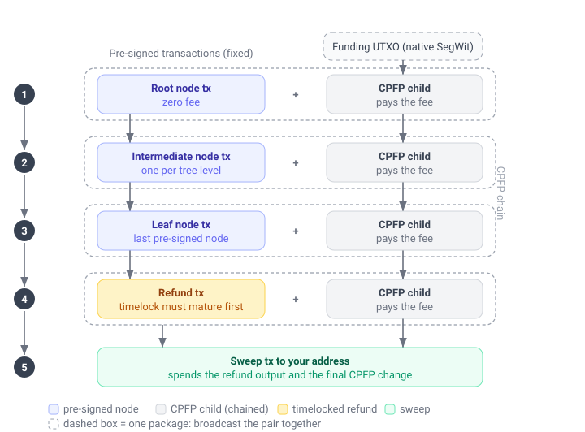

# Unilateral exit

A unilateral exit moves your Spark balance onto the Bitcoin blockchain without needing the Spark operators to sign the withdrawal for you. It exists as a safety net: if the operators ever stop cooperating with normal [withdrawals](send_payment.md), you can still recover your funds on-chain.

A unilateral exit is a last resort. It is a multi-step, on-chain process that needs your own Bitcoin (in a separate UTXO) to pay mining fees, and it can take several days to finish because of on-chain timelocks. When a normal cooperative withdrawal is available, it is always cheaper and faster: prefer it.

## Before you start

Three things are important to know before you build an exit:

- **The exit data has to already be on the device.** Quoting and building an exit read each leaf's pre-signed transactions from local storage, so both work with the operators unreachable. What they cannot do is obtain that data: a leaf can be exited this way only once it has been synced at least once while the operators were reachable. The SDK collects it as funds arrive, in the background where background services run and otherwise during `sync_wallet`, which you can turn off with [`exit_chain_auto_fetch_enabled`](./config.md#unilateral-exit-data). Call `sync_wallet` before going offline to run the collection at a moment of your choosing rather than waiting on the background one. Once collected it can be kept outside the SDK's storage, see [Back up the exit data](#back-up-the-exit-data).
- **You pay the fees from your own UTXO.** The pre-signed transactions carry no fee, so each is fee-bumped with a child transaction (CPFP) funded by a Bitcoin UTXO you provide. That UTXO must be **native SegWit** (a witness-program script). P2WPKH and P2TR are handled by the built-in signer; any other witness program (for example a P2WSH multisig) works through the `CpfpFundingKind::Custom` funding kind and a custom signer (see [The signer](#the-signer)). Legacy (non-SegWit) scripts are rejected.
- **You broadcast the transactions yourself.** The SDK builds and signs the full set but never broadcasts. You send them to the network over time, in order, as their timelocks mature. See [Broadcasting the transactions](#broadcast-the-transactions).

## How it works

Your balance is held in a tree of pre-signed Bitcoin transactions. Each leaf is a portion of the balance. To move a leaf on-chain you broadcast the chain of transactions from the tree down to that leaf, then a refund transaction, then a final sweep to your destination address. Because the pre-signed transactions pay no fee on their own, each one is broadcast together with a CPFP child that pays its fee.

The exit is two calls:

1. `prepare_unilateral_exit` quotes the exit: it picks which leaves to exit and reports the exact fee and how much to fund, without needing any funding UTXOs yet.
2. `unilateral_exit` takes that quote plus your funding UTXOs and a signer, and returns the complete, signed set of transactions to broadcast.

### A single leaf

With one leaf there is no fan-out: your funding UTXO pays the fees directly. You broadcast the tree transactions top to bottom, each with its CPFP child as a package, then the refund once its timelock matures, then the sweep.



The blue transactions come pre-signed and fixed; you cannot change them. The grey CPFP children and the green sweep are built for you from the funding you supply, and are what actually pay the fees and deliver the funds to your address.

### Multiple leaves

Exiting several leaves at once starts with a **fan-out** transaction that splits a single funding UTXO into one output per branch. Leaves that share ancestors in the tree share those transactions too, so a shared ancestor is broadcast only once. Every branch's refund is then pulled into a single sweep.


## Leaf denominations and exit cost

Every leaf is exited by its own chain of transactions, so it carries its own on-chain fee whatever its value. The more leaves your balance is spread across, and the smaller they are, the more of it goes to fees on the way out, and the more low-value leaves an `ExitLeafSelection::Auto` exit abandons as uneconomical dust.

How the balance is split into leaves is governed by the SDK's leaf optimization, which balances everyday payment experience against unilateral exit value. More, smaller denominations let payments go out without leaf swaps, while fewer, larger denominations cost less to exit. The default leans toward payment experience, which suits most wallets, since a unilateral exit is a rare last resort. See [Custom leaf optimization](optimize.md) to understand this tradeoff and adjust it if your use case calls for it.

## Quote the exit

Call `prepare_unilateral_exit` with the target `fee_rate_sat_per_vbyte`, the `funding_kind` of UTXO you will pay fees with, your `destination` address, and a `selection`. `ExitLeafSelection::Auto` exits every leaf worth more than its own exit cost; `ExitLeafSelection::Specific` exits exactly the leaves you name.

The quote returns a `PrepareUnilateralExitResponse`. Its fields tell you how much Bitcoin to gather and how to structure it:

- `recoverable_value_sat` is the total value of the selected `leaves`, and `total_fee_sat` is the on-chain fee to recover it. Compare them to decide whether the exit is worth it at the current fee rate.
- `single_utxo_funding_sat` is the simplest option: fund **one** UTXO of at least this many satoshis and the SDK fans it out across branches.
- `per_branch_funding` lets you skip the fan-out (and its `fanout_fee_sat`) by funding **one UTXO per branch**, each of at least the amount in its `PerBranchFunding` entry.

So you do not have to guess how much to send or how many UTXOs to prepare: the quote tells you both.

Under `ExitLeafSelection::Auto` a leaf is kept when its value exceeds its own exit cost, measured per leaf. That per-leaf measure does not include the shared `fanout_fee_sat`, which the single-UTXO path pays once for the whole exit. So when you fund a multi-leaf exit from a **single** UTXO, the fan-out fee can push the total above what you recover, even though every leaf looked profitable on its own.

Two rules keep an exit from ever costing more than it returns:

1. **Before funding, require `recoverable_value_sat` to exceed `total_fee_sat`.** These are the actual totals for the quote, fan-out fee included. If the margin is thin or negative, do not proceed as quoted.
2. **Prefer per-branch funding.** Funding one UTXO per branch (`per_branch_funding`) skips the fan-out entirely, so there is no shared fee. Because `ExitLeafSelection::Auto` already keeps only leaves worth more than their own cost, a per-branch-funded auto exit is always net-positive.

If the single-UTXO total is not worth it, either fund per branch, or narrow the set: re-quote with `ExitLeafSelection::Specific` naming only the higher-value leaves (dropping the marginal ones removes their cost and can turn the total positive), or wait for a lower fee rate.

If nothing is selected (under `ExitLeafSelection::Auto` no leaf is worth exiting at the given fee rate, or there is nothing to exit) the response comes back empty rather than as an error. Check `leaves` before gathering funding.

### Rust

```rust
let quote = sdk
    .prepare_unilateral_exit(PrepareUnilateralExitRequest {
        fee_rate_sat_per_vbyte: 2,
        funding_kind: CpfpFundingKind::P2wpkh,
        destination: "bc1q...your-destination-address".to_string(),
        selection: ExitLeafSelection::Auto,
    })
    .await?;

println!(
    "Recovering {} sats for {} sats in fees",
    quote.recoverable_value_sat, quote.total_fee_sat
);
println!("Fund a single UTXO of at least {} sats", quote.single_utxo_funding_sat);
```

### Swift

```swift
let quote = try await sdk.prepareUnilateralExit(
    request: PrepareUnilateralExitRequest(
        feeRateSatPerVbyte: 2,
        fundingKind: .p2wpkh,
        destination: "bc1q...your-destination-address",
        selection: .auto
    )
)

print("Recovering \(quote.recoverableValueSat) sats for \(quote.totalFeeSat) sats in fees")
print("Fund a single UTXO of at least \(quote.singleUtxoFundingSat) sats")
```

### Kotlin

```kotlin
val quote = sdk.prepareUnilateralExit(
    PrepareUnilateralExitRequest(
        feeRateSatPerVbyte = 2u,
        fundingKind = CpfpFundingKind.P2wpkh,
        destination = "bc1q...your-destination-address",
        selection = ExitLeafSelection.Auto
    )
)

println("Recovering ${quote.recoverableValueSat} sats for ${quote.totalFeeSat} sats in fees")
println("Fund a single UTXO of at least ${quote.singleUtxoFundingSat} sats")
```

### C#

```csharp
var quote = await sdk.PrepareUnilateralExit(
    request: new PrepareUnilateralExitRequest(
        feeRateSatPerVbyte: 2,
        fundingKind: new CpfpFundingKind.P2wpkh(),
        destination: "bc1q...your-destination-address",
        selection: new ExitLeafSelection.Auto()
    )
);

Console.WriteLine($"Recovering {quote.recoverableValueSat} sats for {quote.totalFeeSat} sats in fees");
Console.WriteLine($"Fund a single UTXO of at least {quote.singleUtxoFundingSat} sats");
```

### Javascript (Wasm)

```typescript
const quote = await sdk.prepareUnilateralExit({
  feeRateSatPerVbyte: 2,
  fundingKind: { type: 'p2wpkh' },
  destination: 'bc1q...your-destination-address',
  selection: { type: 'auto' }
})

console.log(`Recovering ${quote.recoverableValueSat} sats for ${quote.totalFeeSat} sats in fees`)
console.log(`Fund a single UTXO of at least ${quote.singleUtxoFundingSat} sats`)
```

### React Native

```typescript
const quote = await sdk.prepareUnilateralExit({
  feeRateSatPerVbyte: BigInt(2),
  fundingKind: new CpfpFundingKind.P2wpkh(),
  destination: 'bc1q...your-destination-address',
  selection: new ExitLeafSelection.Auto()
})

console.log(`Recovering ${quote.recoverableValueSat} sats for ${quote.totalFeeSat} sats in fees`)
console.log(`Fund a single UTXO of at least ${quote.singleUtxoFundingSat} sats`)
```

### Flutter

```dart
PrepareUnilateralExitRequest request = PrepareUnilateralExitRequest(
  feeRateSatPerVbyte: BigInt.from(2),
  fundingKind: const CpfpFundingKind.p2Wpkh(),
  destination: "bc1q...your-destination-address",
  selection: const ExitLeafSelection.auto(),
);

PrepareUnilateralExitResponse quote = await sdk.prepareUnilateralExit(request: request);

print("Recovering ${quote.recoverableValueSat} sats for ${quote.totalFeeSat} sats in fees");
print("Fund a single UTXO of at least ${quote.singleUtxoFundingSat} sats");
```

### Python

```python
quote = await sdk.prepare_unilateral_exit(
    request=PrepareUnilateralExitRequest(
        fee_rate_sat_per_vbyte=2,
        funding_kind=CpfpFundingKind.P2WPKH(),
        destination="bc1q...your-destination-address",
        selection=ExitLeafSelection.AUTO(),
    ),
)

logging.debug(
    f"Recovering {quote.recoverable_value_sat} sats "
    f"for {quote.total_fee_sat} sats in fees"
)
logging.debug(f"Fund a single UTXO of at least {quote.single_utxo_funding_sat} sats")
```

### Go

```go
quote, err := sdk.PrepareUnilateralExit(breez_sdk_spark.PrepareUnilateralExitRequest{
	FeeRateSatPerVbyte: 2,
	FundingKind:        breez_sdk_spark.CpfpFundingKindP2wpkh{},
	Destination:        "bc1q...your-destination-address",
	Selection:          breez_sdk_spark.ExitLeafSelectionAuto{},
})
if err != nil {
	return nil, err
}

log.Printf("Recovering %d sats for %d sats in fees", quote.RecoverableValueSat, quote.TotalFeeSat)
log.Printf("Fund a single UTXO of at least %d sats", quote.SingleUtxoFundingSat)
```


## Build the exit

Gather funding that meets the quote, then call `unilateral_exit` with the quote, your real `CpfpInput` funding UTXOs, and a signer. It returns a `UnilateralExitResponse` with the actual `total_fee_sat` and the full transaction set.

If the funding is below what the exit needs it returns `SdkError::InsufficientCpfpFunds`. If one of the funding UTXOs has already been spent (for example by an earlier attempt) it returns `SdkError::FundingUtxoConflict`, which names the conflicting outpoint so you can supply fresh funding.

A very thin-margin exit can fail even when the funding is sufficient: if the recoverable value net of fees would leave the swept output below the destination address's dust limit, the sweep cannot be built and the exit fails. Exit higher-value leaves with `ExitLeafSelection::Specific`, lower the `fee_rate_sat_per_vbyte`, or wait for a cheaper fee rate.

The set it builds depends on what is already on-chain. Because each CPFP child spends the previous one, the exit is one connected chain, so to continue it correctly the SDK reads confirmed on-chain state through its chain service: a step already confirmed comes back as `ConfirmationStatus::Confirmed` and is not rebuilt. If the chain service cannot resolve a step, the SDK falls back to the status the operators reported: a node the operators already consider on-chain is left as-is rather than fee-bumped (bumping an already-confirmed node would invalidate the rest of the chain), and any node whose state still cannot be determined comes back as `ConfirmationStatus::Unverified` and is treated as not yet confirmed rather than failing the build. You still get the full set back; broadcasting an already-confirmed transaction is harmless, and re-running once the chain service recovers resolves the status. For a more reliable source you can supply your own chain service (see [Customizing the SDK](customizing.md#with-chain-service)).

### Rust

```rust
let secret_key_bytes: Vec<u8> = hex::decode("your-secret-key-hex")?;
let signer = signer::single_key_cpfp_signer(secret_key_bytes)?;

let response = sdk
    .unilateral_exit(
        UnilateralExitRequest {
            prepared: quote,
            funding_inputs: vec![CpfpInput::P2wpkh {
                txid: "your-utxo-txid".to_string(),
                vout: 0,
                value: 50_000,
                pubkey: "your-compressed-pubkey-hex".to_string(),
            }],
        },
        signer,
    )
    .await?;

for tx in &response.transactions {
    if let Some(blocks) = tx.csv_timelock_blocks {
        println!("{}: wait {} blocks after its parents confirm", tx.txid, blocks);
    }
}
```

### Swift

```swift
let secretKeyBytes = Data(hexString: "your-secret-key-hex")!
let signer = try singleKeyCpfpSigner(secretKeyBytes: secretKeyBytes)

let response = try await sdk.unilateralExit(
    request: UnilateralExitRequest(
        prepared: quote,
        fundingInputs: [
            .p2wpkh(
                txid: "your-utxo-txid",
                vout: 0,
                value: 50_000,
                pubkey: "your-compressed-pubkey-hex"
            )
        ]
    ),
    signer: signer
)

for tx in response.transactions {
    if let blocks = tx.csvTimelockBlocks {
        print("\(tx.txid): wait \(blocks) blocks after its parents confirm")
    }
}
```

### Kotlin

```kotlin
try {
    val secretKeyBytes = "your-secret-key-hex".hexToByteArray()
    val signer = singleKeyCpfpSigner(secretKeyBytes)

    val response = sdk.unilateralExit(
        UnilateralExitRequest(
            prepared = quote,
            fundingInputs = listOf(
                CpfpInput.P2wpkh(
                    txid = "your-utxo-txid",
                    vout = 0u,
                    value = 50_000u,
                    pubkey = "your-compressed-pubkey-hex"
                )
            )
        ),
        signer
    )

    for (tx in response.transactions) {
        tx.csvTimelockBlocks?.let { blocks ->
            println("${tx.txid}: wait $blocks blocks after its parents confirm")
        }
    }
} catch (e: Exception) {
    // handle error
}
```

### C#

```csharp
var secretKeyBytes = Convert.FromHexString("your-secret-key-hex");
var signer = BreezSdkSparkMethods.SingleKeyCpfpSigner(secretKeyBytes);

var response = await sdk.UnilateralExit(
    request: new UnilateralExitRequest(
        prepared: quote,
        fundingInputs: new CpfpInput[]
        {
            new CpfpInput.P2wpkh(
                txid: "your-utxo-txid",
                vout: 0,
                value: 50_000,
                pubkey: "your-compressed-pubkey-hex"
            )
        }
    ),
    signer: signer
);

foreach (var tx in response.transactions)
{
    if (tx.csvTimelockBlocks != null)
    {
        Console.WriteLine($"{tx.txid}: wait {tx.csvTimelockBlocks} blocks after its parents confirm");
    }
}
```

### Javascript (Wasm)

```typescript
const secretKeyBytes = Buffer.from('your-secret-key-hex', 'hex')
const signer = singleKeyCpfpSigner(secretKeyBytes)

const response = await sdk.unilateralExit(
  {
    prepared: quote,
    fundingInputs: [{
      type: 'p2wpkh',
      txid: 'your-utxo-txid',
      vout: 0,
      value: 50_000,
      pubkey: 'your-compressed-pubkey-hex'
    }]
  },
  signer
)

for (const tx of response.transactions) {
  if (tx.csvTimelockBlocks != null) {
    console.log(`${tx.txid}: wait ${tx.csvTimelockBlocks} blocks after its parents confirm`)
  }
}
```

### React Native

```typescript
const secretKeyBytes = Buffer.from('your-secret-key-hex', 'hex')
// Buffer.buffer is a shared pool slab; slice to this key's own bytes.
const signer = singleKeyCpfpSigner(
  secretKeyBytes.buffer.slice(
    secretKeyBytes.byteOffset,
    secretKeyBytes.byteOffset + secretKeyBytes.byteLength
  )
)

const response = await sdk.unilateralExit(
  {
    prepared: quote,
    fundingInputs: [
      new CpfpInput.P2wpkh({
        txid: 'your-utxo-txid',
        vout: 0,
        value: BigInt(50_000),
        pubkey: 'your-compressed-pubkey-hex'
      })
    ]
  },
  signer
)

for (const tx of response.transactions) {
  if (tx.csvTimelockBlocks != null) {
    console.log(`${tx.txid}: wait ${tx.csvTimelockBlocks} blocks after its parents confirm`)
  }
}
```

### Flutter

```dart
List<int> secretKeyBytes = hex.decode("your-secret-key-hex");

UnilateralExitResponse response = await sdk.unilateralExit(
  request: UnilateralExitRequest(
    prepared: quote,
    fundingInputs: [
      CpfpInput.p2Wpkh(
        txid: "your-utxo-txid",
        vout: 0,
        value: BigInt.from(50000),
        pubkey: "your-compressed-pubkey-hex",
      ),
    ],
  ),
  signerSecretKey: Uint8List.fromList(secretKeyBytes),
);

for (UnilateralExitTransaction tx in response.transactions) {
  if (tx.csvTimelockBlocks != null) {
    print("${tx.txid}: wait ${tx.csvTimelockBlocks} blocks after its parents confirm");
  }
}
```

### Python

```python
secret_key_bytes = bytes.fromhex("your-secret-key-hex")
signer = single_key_cpfp_signer(secret_key_bytes=secret_key_bytes)

response = await sdk.unilateral_exit(
    request=UnilateralExitRequest(
        prepared=quote,
        funding_inputs=[
            CpfpInput.P2WPKH(  # type: ignore[list-item]
                txid="your-utxo-txid",
                vout=0,
                value=50_000,
                pubkey="your-compressed-pubkey-hex",
            )
        ],
    ),
    signer=signer,
)

for tx in response.transactions:
    if tx.csv_timelock_blocks is not None:
        logging.debug(
            f"{tx.txid}: wait {tx.csv_timelock_blocks} blocks after its parents confirm"
        )
```

### Go

```go
secretKeyBytes, err := hex.DecodeString("your-secret-key-hex")
if err != nil {
	return err
}
signer, err := breez_sdk_spark.SingleKeyCpfpSigner(secretKeyBytes)
if err != nil {
	return err
}

response, err := sdk.UnilateralExit(breez_sdk_spark.UnilateralExitRequest{
	Prepared: quote,
	FundingInputs: []breez_sdk_spark.CpfpInput{
		breez_sdk_spark.CpfpInputP2wpkh{
			Txid:   "your-utxo-txid",
			Vout:   0,
			Value:  50_000,
			Pubkey: "your-compressed-pubkey-hex",
		},
	},
}, signer)
if err != nil {
	return err
}

for _, tx := range response.Transactions {
	if tx.CsvTimelockBlocks != nil {
		fmt.Printf("%s: wait %d blocks after its parents confirm\n", tx.Txid, *tx.CsvTimelockBlocks)
	}
}
```


### The signer

The CPFP children and the fan-out spend your funding UTXOs, so they have to be signed. The SDK does not hold your funding keys; it hands each unsigned transaction to a signer you provide.

The built-in single-key signer covers the common case: it signs P2WPKH and P2TR inputs from one secret key. For `CpfpInput::P2tr` funding, pass the **internal, untweaked (BIP86)** key, not the tweaked on-chain output key: the tweaked key derives a scriptPubKey that does not match the UTXO, so the transaction is rejected at broadcast. For anything else (a multisig, a hardware wallet, or keeping key material out of the SDK entirely) implement the `CpfpSigner` interface and describe the funding with `CpfpFundingKind::Custom` (in the quote) and `CpfpInput::Custom` (in the build). Those carry the funding `script_pubkey_hex` and an upper-bound `signed_input_weight` so the fee stays exact for any witness program. The signer receives a serialized PSBT, signs the inputs that are not already finalized, and returns the serialized signed PSBT:

Whichever signer you use, the funding inputs must be **native SegWit** (a witness-program script; P2WPKH or P2TR with the built-in signer, any other witness program with a custom one). The exit refers to each transaction by an id it computes before signing, which only stays stable when the signature lives in the witness (native SegWit) rather than in the input script; legacy scripts are rejected, so your signer only ever has to sign native SegWit inputs.

#### Rust

```rust
struct MyCpfpSigner;

#[async_trait::async_trait]
impl signer::CpfpSigner for MyCpfpSigner {
    async fn sign_psbt(&self, psbt_bytes: Vec<u8>) -> Result<Vec<u8>, SignerError> {
        let signed_psbt_bytes = sign_psbt_with_your_keys(psbt_bytes)?;
        Ok(signed_psbt_bytes)
    }
}

fn sign_psbt_with_your_keys(psbt_bytes: Vec<u8>) -> Result<Vec<u8>, SignerError> {
    Ok(psbt_bytes)
}
```

#### Swift

```swift
class CustomCpfpSigner: CpfpSigner {
    func signPsbt(psbtBytes: Data) async throws -> Data {
        return try await signPsbtWithYourKeys(psbtBytes: psbtBytes)
    }

    private func signPsbtWithYourKeys(psbtBytes: Data) async throws -> Data {
        return psbtBytes
    }
}
```

#### Kotlin

```kotlin
class MyCpfpSigner : CpfpSigner {
    override suspend fun signPsbt(psbtBytes: ByteArray): ByteArray {
        return signPsbtWithYourKeys(psbtBytes)
    }

    private fun signPsbtWithYourKeys(psbtBytes: ByteArray): ByteArray {
        return psbtBytes
    }
}
```

#### C#

```csharp
class MyCpfpSigner : CpfpSigner
{
    public async Task<byte[]> SignPsbt(byte[] psbtBytes)
    {
        return await SignPsbtWithYourKeys(psbtBytes);
    }

    async Task<byte[]> SignPsbtWithYourKeys(byte[] psbtBytes)
    {
        return await Task.FromResult(psbtBytes);
    }
}
```

#### Javascript (Wasm)

```typescript
class CustomCpfpSigner implements CpfpSigner {
  async signPsbt (psbtBytes: Uint8Array): Promise<Uint8Array> {
    return await signPsbtWithYourKeys(psbtBytes)
  }
}

const signPsbtWithYourKeys = async (psbtBytes: Uint8Array): Promise<Uint8Array> => {
  return psbtBytes
}
```

#### React Native

```typescript
class CustomCpfpSigner {
  signPsbt = async (psbtBytes: ArrayBuffer): Promise<ArrayBuffer> => {
    return await signPsbtWithYourKeys(psbtBytes)
  }
}

const signPsbtWithYourKeys = async (psbtBytes: ArrayBuffer): Promise<ArrayBuffer> => {
  return psbtBytes
}
```

#### Flutter

```dart
Future<void> buildExitWithSigner(BreezSdk sdk, PrepareUnilateralExitResponse quote) async {
  // Flutter cannot pass a foreign CpfpSigner, so it takes a signPsbt callback.
  UnilateralExitResponse response = await sdk.unilateralExitWithSigner(
    request: UnilateralExitRequest(
      prepared: quote,
      fundingInputs: [
        CpfpInput.p2Wpkh(
          txid: "your-utxo-txid",
          vout: 0,
          value: BigInt.from(50000),
          pubkey: "your-compressed-pubkey-hex",
        ),
      ],
    ),
    signPsbt: (Uint8List psbtBytes) async {
      return signPsbtWithYourKeys(psbtBytes);
    },
  );

  for (UnilateralExitTransaction tx in response.transactions) {
    if (tx.csvTimelockBlocks != null) {
      print("${tx.txid}: wait ${tx.csvTimelockBlocks} blocks after its parents confirm");
    }
  }
}

// Receives the serialized PSBT, signs the inputs that are not already
// finalized, and returns the serialized signed PSBT.
Future<Uint8List> signPsbtWithYourKeys(Uint8List psbtBytes) async {
  return psbtBytes;
}
```

#### Python

```python
class CustomCpfpSigner(CpfpSigner):
    async def sign_psbt(self, psbt_bytes: bytes) -> bytes:
        return sign_psbt_with_your_keys(psbt_bytes)


def sign_psbt_with_your_keys(psbt_bytes: bytes) -> bytes:
    raise NotImplementedError("Sign the PSBT's non-finalized inputs with your keys")
```

#### Go

```go
type MyCpfpSigner struct{}

func (MyCpfpSigner) SignPsbt(psbtBytes []byte) ([]byte, error) {
	return signPsbtWithYourKeys(psbtBytes)
}

func signPsbtWithYourKeys(psbtBytes []byte) ([]byte, error) {
	return psbtBytes, nil
}
```


**Flutter**

Flutter cannot pass a foreign <code>CpfpSigner</code>, so it exposes two exit calls. <code>unilateralExit</code> takes the funding secret key bytes and uses the built-in single-key signer. <code>unilateralExitWithSigner</code> takes a <code>signPsbt</code> callback that receives the serialized PSBT, signs the inputs that are not already finalized (any scheme), and returns the serialized signed PSBT.

## Broadcast the transactions

The SDK does not broadcast anything. `transactions` is the complete, signed set in valid broadcast order, and it is yours to send to the network over time. Persist it, then broadcast each transaction once it is ready. A transaction is ready when every txid in its `depends_on` has confirmed and its `csv_timelock_blocks` relative timelock has matured. Because of those timelocks, a full exit can span several days.

### Broadcast each package together

Most steps come as a pair: a tree transaction and its `cpfp_tx_hex` CPFP child. The tree transaction pays no fee on its own, so a normal single-transaction broadcast rejects it; only the child makes the pair pay enough. Broadcast the two together, as a package, with a node that supports package relay, for example Bitcoin Core:

```text
bitcoin-cli submitpackage '["<tx_hex>", "<cpfp_tx_hex>"]'
```

The **fan-out** and the **sweep** are the exceptions: each pays its own fee and has no CPFP child (`cpfp_tx_hex` is unset), so you broadcast it **alone**, as an ordinary transaction, anywhere — including a public endpoint such as `POST https://mempool.space/api/tx`. Most public broadcast APIs, including mempool.space, accept only one transaction at a time and cannot submit a package, so they reject the zero-fee tree transactions; use a package-relay-capable node (or service) for the pairs.

### Wait for each step to confirm

Within a branch you broadcast one package, wait for it to confirm, then broadcast the next. This is a mempool relay limit, not a Bitcoin consensus rule: nodes relay an unconfirmed parent with at most one unconfirmed child (the "one-parent-one-child", or 1P1C, package), so a second still-unconfirmed package stacked on top would not propagate. Once a package confirms, the next one has a confirmed parent and can go out. (A refund's `csv_timelock_blocks` is a separate wait, and that one is a consensus rule.)

### Order and parallelism

Follow `depends_on` to order the set: a transaction can go out as soon as the transactions it lists have confirmed. With a single leaf this is one straight line, top to bottom. With several leaves the branches are largely independent, so to finish faster you can broadcast them in parallel and serialize only where `depends_on` actually links them:

1. **The fan-out first, and alone.** It pays its own fee and has no CPFP child, so it is an ordinary single-transaction broadcast. Wait for it to confirm before any branch package — every branch's first package depends on it.
2. **Then the branch packages, each node transaction with its CPFP child.** A shared ancestor appears once, listed in the `depends_on` of every branch that needs it, so you broadcast it a single time. Within a branch, send one package, wait for it to confirm, then the next (the 1P1C limit above); across branches you can work in parallel.
3. **The sweep last, and alone,** once every refund in its `depends_on` has confirmed.

## The transaction set

Each `UnilateralExitTransaction` in `transactions` carries:

- `kind`: whether it is the fan-out, a tree node, a refund, or the sweep.
- `node_id`: the tree node a transaction belongs to (the leaf id for a refund), unset for the fan-out and the sweep.
- `txid` and `tx_hex`: the signed transaction to broadcast.
- `cpfp_tx_hex`: its signed CPFP child, to broadcast alongside `tx_hex` as a package. Unset for the fan-out and the sweep, and for a step that is already confirmed.
- `csv_timelock_blocks`: the relative timelock, in blocks, that must mature before the transaction can confirm.
- `depends_on`: the txids of other transactions in the set that must confirm first.
- `status`: whether the transaction is already on-chain. `ConfirmationStatus::Confirmed` means it is done and can be skipped; `ConfirmationStatus::Unconfirmed` is the normal state of a step that is not yet on-chain and that you must broadcast; `ConfirmationStatus::Unverified` means its on-chain status could not be determined (see the troubleshooting table).

## Resuming and increasing the fee

`unilateral_exit` is safe to call again. It reads confirmed on-chain state on every call, so any step already confirmed comes back as `ConfirmationStatus::Confirmed`, and an interrupted exit resumes from where it stopped instead of starting over. You never re-supply a previously built exit transaction: the SDK re-discovers the confirmed steps — including a confirmed fan-out — from chain state itself. The only thing you ever pass back in is a confirmed fan-out's *outputs*, and only as fresh funding UTXOs when a higher fee rate needs more than they provide (as described just below).

For the most reliable resume, re-quote with `ExitLeafSelection::Specific` naming the same leaves as your original quote, rather than `ExitLeafSelection::Auto`, then call `unilateral_exit` again. Persist the leaf ids from that first quote so you can name them. Naming the leaves explicitly is the most dependable way to pick up an interrupted exit, including a leaf still waiting out its refund timelock.

The reported fee reflects on-chain progress. `unilateral_exit`'s `total_fee_sat` is the actual fee of only the transactions it still returns, so a resume costs less than a fresh exit — already-confirmed steps are free. `prepare_unilateral_exit` works from the operators' reported node state rather than a chain lookup, so it treats any node the operators already consider on-chain as paid; a partially-exited leaf therefore quotes cheaper, and its `per_branch_funding` drops to match.

To re-broadcast the same leaves at a higher fee, quote again with the same `ExitLeafSelection::Specific` leaves and a higher `fee_rate_sat_per_vbyte`, then call `unilateral_exit` again. The not-yet-confirmed transactions are rebuilt at the higher fee and replace the earlier ones by RBF; confirmed steps are left as they are. Once a fan-out has confirmed its outputs are fixed at the fee they were built with, so if the higher rate needs more than they provide the call returns `SdkError::InsufficientCpfpFunds`; because those outputs pay to your own funding script, you recover by quoting again and passing them back in as funding UTXOs, together with any extra funding needed.

Confirmed *CPFP* transactions hold funds the same way: once one confirms, your funds sit in its change output. To raise the fee beyond what a confirmed output covers, supply that output back in as a funding UTXO alongside the extra funding — list the confirmed output(s) first, then the new UTXO — so the rebuild spends the confirmed CPFP outputs together with the new funding rather than being capped by them. (Supplying the remaining unspent outputs yourself works too.)

## Back up the exit data

The transactions an exit is built from are held in the SDK's local storage. While the operators are reachable they can be fetched again, so a wallet restored from its seed rebuilds them on its own. When that storage is gone and the operators are unreachable, they cannot be recovered from anywhere, and the leaves they cover cannot be exited.

`export_unilateral_exit_state` returns that data as a single opaque value, covering every leaf the wallet holds together with the transactions that spend it. It reflects what is present when it is called: a leaf whose data has not been collected yet is exported without it. The value grows with the number of leaves and can reach several megabytes.

Treat the value as sensitive. Carrying every leaf and its transactions, it discloses the wallet's balance, how that balance is split up, and the history of what the wallet has received and spent. Encrypt it wherever you keep it.

### Rust

```rust
let exported = sdk.export_unilateral_exit_state().await?;

// Keep the state somewhere the wallet's own storage cannot take with it.
println!("Exit state is {} bytes", exported.exit_state.len());
```

### Swift

```swift
let exported = try await sdk.exportUnilateralExitState()

// Keep the state somewhere the wallet's own storage cannot take with it.
print("Exit state is \(exported.exitState.count) bytes")
```

### Kotlin

```kotlin
val exported = sdk.exportUnilateralExitState()

// Keep the state somewhere the wallet's own storage cannot take with it.
// Log.v("Breez", "Exit state is ${exported.exitState.length} bytes")
```

### C#

```csharp
var exported = await sdk.ExportUnilateralExitState();

// Keep the state somewhere the wallet's own storage cannot take with it.
Console.WriteLine($"Exit state is {exported.exitState.Length} bytes");
```

### Javascript (Wasm)

```typescript
const exported = await sdk.exportUnilateralExitState()

// Keep the state somewhere the wallet's own storage cannot take with it.
console.log(`Exit state is ${exported.exitState.length} bytes`)
```

### React Native

```typescript
const exported = await sdk.exportUnilateralExitState()

// Keep the state somewhere the wallet's own storage cannot take with it.
console.log(`Exit state is ${exported.exitState.length} bytes`)
```

### Flutter

```dart
ExportUnilateralExitStateResponse exported = await sdk.exportUnilateralExitState();

// Keep the state somewhere the wallet's own storage cannot take with it.
print("Exit state is ${exported.exitState.length} bytes");
```

### Python

```python
exported = await sdk.export_unilateral_exit_state()

# Keep the state somewhere the wallet's own storage cannot take with it.
logging.debug(f"Exit state is {len(exported.exit_state)} bytes")
```

### Go

```go
exported, err := sdk.ExportUnilateralExitState()
if err != nil {
	return "", err
}

// Keep the state somewhere the wallet's own storage cannot take with it.
log.Printf("Exit state is %v bytes", len(exported.ExitState))
```


The SDK emits `SdkEvent::UnilateralExitStateChanged` once it has completed the data for a leaf that was missing it, and whenever it rebuilds a leaf's data. That is the point at which a previously exported value stops covering the wallet. A leaf the operators answer for only in part is not announced: what came back still cannot back an exit, and it stays that way until they complete it.

`import_unilateral_exit_state` puts an exported value back. It does not contact the operators, so it works while they are unreachable, and the value must come from the same network the SDK is configured for. A leaf is taken only when the exit state records this wallet as its owner; the rest are skipped and counted in `skipped_foreign_leaves`.

For the leaves it does take, the wallet keeps whatever exit data it can already exit with. An exported value carries no mark of when it was taken, so nothing in it says it is newer than what is on the device; the imported copy is used only for a leaf the wallet has nothing usable for, and only when that copy is complete on its own. Importing an out of date or half-collected value therefore never leaves a leaf less exitable than it already was. Leaves the wallet keeps but whose imported copy it did not use are counted in `skipped_chains`.

A leaf is dropped outright when its imported copy disagrees with a node the wallet already holds, on a value that cannot change over a node's lifetime. One of the two copies is then simply wrong about that node, and nothing in the entry is trusted on the strength of it, so the leaf is not restored at all. These are counted separately, in `skipped_conflicting_leaves`, because unlike the counts above they mark exit data the import could not put back.

### Rust

```rust
let imported = sdk
    .import_unilateral_exit_state(ImportUnilateralExitStateRequest { exit_state })
    .await?;

println!(
    "Imported {} leaves, skipped {}",
    imported.imported_leaves, imported.skipped_foreign_leaves
);
```

### Swift

```swift
let imported = try await sdk.importUnilateralExitState(
    request: ImportUnilateralExitStateRequest(exitState: exitState)
)

print("Imported \(imported.importedLeaves) leaves, skipped \(imported.skippedForeignLeaves)")
```

### Kotlin

```kotlin
val imported = sdk.importUnilateralExitState(
    ImportUnilateralExitStateRequest(exitState)
)

// Log.v(
//     "Breez",
//     "Imported ${imported.importedLeaves} leaves, skipped ${imported.skippedForeignLeaves}"
// )
```

### C#

```csharp
var imported = await sdk.ImportUnilateralExitState(
    request: new ImportUnilateralExitStateRequest(exitState: exitState)
);

Console.WriteLine($"Imported {imported.importedLeaves} leaves, " +
    $"skipped {imported.skippedForeignLeaves}");
```

### Javascript (Wasm)

```typescript
const imported = await sdk.importUnilateralExitState({ exitState })

console.log(`Imported ${imported.importedLeaves} leaves, skipped ${imported.skippedForeignLeaves}`)
```

### React Native

```typescript
const imported = await sdk.importUnilateralExitState({ exitState })

console.log(`Imported ${imported.importedLeaves} leaves, skipped ${imported.skippedForeignLeaves}`)
```

### Flutter

```dart
ImportUnilateralExitStateResponse imported = await sdk.importUnilateralExitState(
  request: ImportUnilateralExitStateRequest(exitState: exitState),
);

print("Imported ${imported.importedLeaves} leaves, skipped ${imported.skippedForeignLeaves}");
```

### Python

```python
imported = await sdk.import_unilateral_exit_state(
    request=ImportUnilateralExitStateRequest(exit_state=exit_state)
)

logging.debug(
    f"Imported {imported.imported_leaves} leaves, "
    f"skipped {imported.skipped_foreign_leaves}"
)
```

### Go

```go
imported, err := sdk.ImportUnilateralExitState(breez_sdk_spark.ImportUnilateralExitStateRequest{
	ExitState: exitState,
})
if err != nil {
	return err
}

log.Printf("Imported %d leaves, skipped %d", imported.ImportedLeaves, imported.SkippedForeignLeaves)
```


An out of date value can restore leaves that have since been spent, so the balance may read high until the next sync reconciles it with the operators.

## Troubleshooting

| Problem | Cause | Solution |
|---------|-------|----------|
| `prepare_unilateral_exit` returns no `leaves` | Under `ExitLeafSelection::Auto`, no leaf is worth exiting at the current rate | Lower `fee_rate_sat_per_vbyte` or wait for cheaper on-chain fees (this is not an error) |
| A leaf you are mid-exit on is missing from a resumed `ExitLeafSelection::Auto` quote | The resume reselected leaves with `ExitLeafSelection::Auto` instead of naming them | Re-quote with `ExitLeafSelection::Specific`, naming the leaves from your original quote |
| `total_fee_sat` is close to or above `recoverable_value_sat` | The shared fan-out fee makes a single-UTXO multi-leaf exit uneconomical | Fund one UTXO per branch (`per_branch_funding`) to drop the fan-out fee, exit fewer leaves with `ExitLeafSelection::Specific`, or wait for a lower fee rate |
| The build/sweep fails with a "below the dust limit" error | The recoverable value net of fees is below the destination's dust limit | Exit higher-value leaves with `ExitLeafSelection::Specific`, lower the `fee_rate_sat_per_vbyte`, or wait for a cheaper fee rate |
| `SdkError::InsufficientCpfpFunds` | Funding is below what the exit needs | Fund at least `single_utxo_funding_sat`, or the amount in each `PerBranchFunding` |
| `SdkError::FundingUtxoConflict` | A funding UTXO was already spent (e.g. a previous attempt) | Supply fresh, unspent funding; the error names the conflicting outpoint |
| "min relay fee not met" when broadcasting | The package fee is too low for the network | Increase `fee_rate_sat_per_vbyte`, rebuild, and re-broadcast (RBF) |
| "mandatory-script-verify-flag-failed" | A CPFP child was not signed correctly | Ensure your `CpfpSigner` signs every non-finalized input |
| "non-BIP68-final" | A relative timelock has not matured | Wait the required `csv_timelock_blocks` after the parent confirms |
| A tree transaction is rejected on its own | The zero-fee parent was broadcast without its child | Broadcast the parent and its `cpfp_tx_hex` together as a package |
| The sweep is rejected | Not every refund it spends has confirmed | Wait for all of the sweep's `depends_on` to confirm first |
| A transaction's `status` is `ConfirmationStatus::Unverified` | The chain service was unavailable or rate-limited, so the SDK could not tell whether that step is already on-chain | Retry, or use a more reliable chain service (see [Customizing the SDK](customizing.md#with-chain-service)); calling `unilateral_exit` again re-checks |

---

Identifier casing: `get_info` here is `getInfo` in Swift, Kotlin, JavaScript, React Native and Flutter, and `GetInfo` in Go and C#. Enum variants: `SdkEvent::Synced` is `SdkEvent.SYNCED` in Python, `SdkEvent.synced` in Swift, `SdkEventSynced` in Go, and `SdkEvent.Synced` elsewhere.
