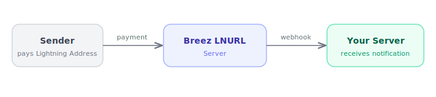
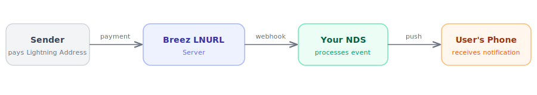

# Lightning Address payment notifications

When one of your users receives a payment to their Lightning Address, Breez can send a webhook to your server. Payments are received automatically without any user interaction — the webhook simply lets you know it happened. For example, you could send the user a push notification, update a balance in your backend, trigger a fulfillment flow, or log the event for analytics.

## How it works

Your users' Lightning Addresses are served by the Breez LNURL server. When a payment comes in, the LNURL server sends a webhook to your server.



As an example, if you want to send push notifications to your users, you could run a Notification Delivery Service (NDS) that receives the webhook and forwards a push notification to the user's device:



## Getting started

To start receiving webhooks, [send us](mailto:contact@breez.technology) your webhook endpoint URL. Breez will configure it for your domain so that all Lightning Address payments on that domain trigger a POST request to your endpoint.

Your endpoint should accept `POST` requests with a JSON body and respond with a `2xx` status code to acknowledge receipt.

## Signature verification

Every webhook request includes an `X-Breez-Signature` header containing a hex-encoded HMAC-SHA256 signature of the raw request body. You should verify this signature to ensure the request came from Breez and was not tampered with.

The signing secret is provided to you during webhook setup. To verify:

1. Compute the HMAC-SHA256 of the raw request body using your shared secret.
2. Hex-encode the result.
3. Compare it to the value in the `X-Breez-Signature` header.

**Node.js example:**

```javascript
const crypto = require('crypto');

function verifyWebhookSignature(secret, body, signatureHeader) {
  const expected = crypto
    .createHmac('sha256', secret)
    .update(body)
    .digest('hex');
  return crypto.timingSafeEqual(
    Buffer.from(expected),
    Buffer.from(signatureHeader),
  );
}
```

**Python example:**

```python
import hmac
import hashlib

def verify_webhook_signature(secret: str, body: bytes, signature_header: str) -> bool:
    expected = hmac.new(secret.encode(), body, hashlib.sha256).hexdigest()
    return hmac.compare_digest(expected, signature_header)
```

## Payload

All payloads use a `{ "template": "...", "data": { ... } }` envelope. Currently the only template is `spark_payment_received`:

```json
{
  "template": "spark_payment_received",
  "data": {
    "payment_hash": "abc123...",
    "invoice": "lnbc50u1p...",
    "preimage": "def456...",
    "amount_sat": 50000,
    "user_pubkey": "02abc123...",
    "lightning_address": "alice@yourdomain.com",
    "sender_comment": "Thanks!",
    "timestamp": 1711929600000
  }
}
```

| Field | Type | Description |
|-------|------|-------------|
| `payment_hash` | `string` | Hex-encoded payment hash |
| `invoice` | `string` | BOLT11 invoice that was paid |
| `preimage` | `string` | Hex-encoded payment preimage |
| `amount_sat` | `number \| null` | Amount received in satoshis. May be `null` in rare cases where the amount is not available. |
| `user_pubkey` | `string` | The Spark identity public key of the user who received the payment |
| `lightning_address` | `string \| null` | The Lightning Address that received the payment (e.g. `alice@yourdomain.com`) |
| `sender_comment` | `string \| null` | Comment attached by the sender, if any |
| `timestamp` | `number` | Milliseconds since Unix epoch when the webhook was enqueued |

## Retries

If your endpoint is unreachable or responds with a non-2xx status code, Breez will automatically retry delivery with exponential backoff. Because of this, your endpoint may receive the same webhook more than once for the same payment — use the `paymentHash` field to deduplicate.

## Best practices

- **Verify the signature.** Always verify the `X-Breez-Signature` header before processing the webhook. Reject requests with missing or invalid signatures.
- **Return 2xx quickly.** Do your processing asynchronously after acknowledging the webhook. Slow responses will be treated as failures and retried.
- **Deduplicate on `paymentHash`.** The same payment may be delivered more than once due to retries.
- **Use `lightningAddress` or `userPubkey` to identify the user.** These fields tell you which user received the payment.
