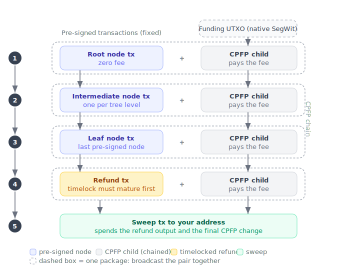
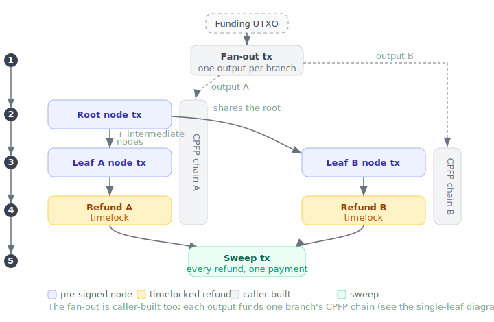

# Unilateral exit

A unilateral exit moves your Spark balance onto the Bitcoin blockchain without needing the Spark operators to sign the withdrawal for you. It exists as a safety net: if the operators ever stop cooperating with normal [withdrawals](send_payment.md), you can still recover your funds on-chain.

<div class="warning">
A unilateral exit is a last resort. It is a multi-step, on-chain process that needs your own Bitcoin (in a separate UTXO) to pay mining fees, and it can take several days to finish because of on-chain timelocks. When a normal cooperative withdrawal is available, it is always cheaper and faster: prefer it.
</div>

## Before you start

Three things are important to know before you build an exit:

- **The operators must currently be reachable.** Both quoting and building the exit fetch your pre-signed transactions from the Spark operators. Recovering purely from locally stored data, with the operators offline or uncooperative, is not supported yet. In other words, this protects you against operators who refuse to *co-sign* a withdrawal, but not yet against operators who are completely unreachable.
- **You pay the fees from your own UTXO.** The pre-signed transactions carry no fee, so each is fee-bumped with a child transaction (CPFP) funded by a Bitcoin UTXO you provide. That UTXO must be **native SegWit** (a witness-program script). P2WPKH and P2TR are handled by the built-in signer; any other witness program (for example a P2WSH multisig) works through the {{#enum CpfpFundingKind::Custom}} funding kind and a custom signer (see [The signer](#the-signer)). Legacy (non-SegWit) scripts are rejected.
- **You broadcast the transactions yourself.** The SDK builds and signs the full set but never broadcasts. You send them to the network over time, in order, as their timelocks mature. See [Broadcasting the transactions](#broadcast-the-transactions).

## How it works

Your balance is held in a tree of pre-signed Bitcoin transactions. Each leaf is a portion of the balance. To move a leaf on-chain you broadcast the chain of transactions from the tree down to that leaf, then a refund transaction, then a final sweep to your destination address. Because the pre-signed transactions pay no fee on their own, each one is broadcast together with a CPFP child that pays its fee.

The exit is two calls:

1. {{#name prepare_unilateral_exit}} quotes the exit: it picks which leaves to exit and reports the exact fee and how much to fund, without needing any funding UTXOs yet.
2. {{#name unilateral_exit}} takes that quote plus your funding UTXOs and a signer, and returns the complete, signed set of transactions to broadcast.

### A single leaf

With one leaf there is no fan-out: your funding UTXO pays the fees directly. You broadcast the tree transactions top to bottom, each with its CPFP child as a package, then the refund once its timelock matures, then the sweep.



The blue transactions come pre-signed and fixed; you cannot change them. The grey CPFP children and the green sweep are built for you from the funding you supply, and are what actually pay the fees and deliver the funds to your address.

### Multiple leaves

Exiting several leaves at once starts with a **fan-out** transaction that splits a single funding UTXO into one output per branch. Leaves that share ancestors in the tree share those transactions too, so a shared ancestor is broadcast only once. Every branch's refund is then pulled into a single sweep.



## Leaf denominations and exit cost

Every leaf is exited by its own chain of transactions, so it carries its own on-chain fee whatever its value. The more leaves your balance is spread across, and the smaller they are, the more of it goes to fees on the way out, and the more low-value leaves an {{#enum ExitLeafSelection::Auto}} exit abandons as uneconomical dust.

How the balance is split into leaves is governed by the SDK's leaf optimization, which balances everyday payment experience against unilateral exit value. More, smaller denominations let payments go out without leaf swaps, while fewer, larger denominations cost less to exit. The default leans toward payment experience, which suits most wallets, since a unilateral exit is a rare last resort. See [Custom leaf optimization](optimize.md) to understand this tradeoff and adjust it if your use case calls for it.

## Quote the exit

Call {{#name prepare_unilateral_exit}} with the target {{#name fee_rate_sat_per_vbyte}}, the {{#name funding_kind}} of UTXO you will pay fees with, your {{#name destination}} address, and a {{#name selection}}. {{#enum ExitLeafSelection::Auto}} exits every leaf worth more than its own exit cost; {{#enum ExitLeafSelection::Specific}} exits exactly the leaves you name.

The quote returns a {{#name PrepareUnilateralExitResponse}}. Its fields tell you how much Bitcoin to gather and how to structure it:

- {{#name recoverable_value_sat}} is the total value of the selected {{#name leaves}}, and {{#name total_fee_sat}} is the on-chain fee to recover it. Compare them to decide whether the exit is worth it at the current fee rate.
- {{#name single_utxo_funding_sat}} is the simplest option: fund **one** UTXO of at least this many satoshis and the SDK fans it out across branches.
- {{#name per_branch_funding}} lets you skip the fan-out (and its {{#name fanout_fee_sat}}) by funding **one UTXO per branch**, each of at least the amount in its {{#name PerBranchFunding}} entry.

So you do not have to guess how much to send or how many UTXOs to prepare: the quote tells you both.

Under {{#enum ExitLeafSelection::Auto}} a leaf is kept when its value exceeds its own exit cost, measured per leaf. That per-leaf measure does not include the shared {{#name fanout_fee_sat}}, which the single-UTXO path pays once for the whole exit. So when you fund a multi-leaf exit from a **single** UTXO, the fan-out fee can push the total above what you recover, even though every leaf looked profitable on its own.

Two rules keep an exit from ever costing more than it returns:

1. **Before funding, require {{#name recoverable_value_sat}} to exceed {{#name total_fee_sat}}.** These are the actual totals for the quote, fan-out fee included. If the margin is thin or negative, do not proceed as quoted.
2. **Prefer per-branch funding.** Funding one UTXO per branch ({{#name per_branch_funding}}) skips the fan-out entirely, so there is no shared fee. Because {{#enum ExitLeafSelection::Auto}} already keeps only leaves worth more than their own cost, a per-branch-funded auto exit is always net-positive.

If the single-UTXO total is not worth it, either fund per branch, or narrow the set: re-quote with {{#enum ExitLeafSelection::Specific}} naming only the higher-value leaves (dropping the marginal ones removes their cost and can turn the total positive), or wait for a lower fee rate.

If nothing is selected (under {{#enum ExitLeafSelection::Auto}} no leaf is worth exiting at the given fee rate, or there is nothing to exit) the response comes back empty rather than as an error. Check {{#name leaves}} before gathering funding.

{{#tabs unilateral_exit:prepare-unilateral-exit}}

## Build the exit

Gather funding that meets the quote, then call {{#name unilateral_exit}} with the quote, your real {{#name CpfpInput}} funding UTXOs, and a signer. It returns a {{#name UnilateralExitResponse}} with the actual {{#name total_fee_sat}} and the full transaction set.

If the funding is below what the exit needs it returns {{#enum SdkError::InsufficientCpfpFunds}}. If one of the funding UTXOs has already been spent (for example by an earlier attempt) it returns {{#enum SdkError::FundingUtxoConflict}}, which names the conflicting outpoint so you can supply fresh funding.

A very thin-margin exit can fail even when the funding is sufficient: if the recoverable value net of fees would leave the swept output below the destination address's dust limit, the sweep cannot be built and the exit fails. Exit higher-value leaves with {{#enum ExitLeafSelection::Specific}}, lower the {{#name fee_rate_sat_per_vbyte}}, or wait for a cheaper fee rate.

The set it builds depends on what is already on-chain. Because each CPFP child spends the previous one, the exit is one connected chain, so to continue it correctly the SDK reads confirmed on-chain state through its chain service: a step already confirmed comes back as {{#enum ConfirmationStatus::Confirmed}} and is not rebuilt. If the chain service cannot resolve a step, the SDK falls back to the status the operators reported: a node the operators already consider on-chain is left as-is rather than fee-bumped (bumping an already-confirmed node would invalidate the rest of the chain), and any node whose state still cannot be determined comes back as {{#enum ConfirmationStatus::Unverified}} and is treated as not yet confirmed rather than failing the build. You still get the full set back; broadcasting an already-confirmed transaction is harmless, and re-running once the chain service recovers resolves the status. For a more reliable source you can supply your own chain service (see [Customizing the SDK](customizing.md#with-chain-service)).

{{#tabs unilateral_exit:unilateral-exit}}

### The signer

The CPFP children and the fan-out spend your funding UTXOs, so they have to be signed. The SDK does not hold your funding keys; it hands each unsigned transaction to a signer you provide.

The built-in single-key signer covers the common case: it signs P2WPKH and P2TR inputs from one secret key. For {{#enum CpfpInput::P2tr}} funding, pass the **internal, untweaked (BIP86)** key, not the tweaked on-chain output key: the tweaked key derives a scriptPubKey that does not match the UTXO, so the transaction is rejected at broadcast. For anything else (a multisig, a hardware wallet, or keeping key material out of the SDK entirely) implement the {{#name CpfpSigner}} interface and describe the funding with {{#enum CpfpFundingKind::Custom}} (in the quote) and {{#enum CpfpInput::Custom}} (in the build). Those carry the funding {{#name script_pubkey_hex}} and an upper-bound {{#name signed_input_weight}} so the fee stays exact for any witness program. The signer receives a serialized PSBT, signs the inputs that are not already finalized, and returns the serialized signed PSBT:

Whichever signer you use, the funding inputs must be **native SegWit** (a witness-program script; P2WPKH or P2TR with the built-in signer, any other witness program with a custom one). The exit refers to each transaction by an id it computes before signing, which only stays stable when the signature lives in the witness (native SegWit) rather than in the input script; legacy scripts are rejected, so your signer only ever has to sign native SegWit inputs.

{{#tabs unilateral_exit:custom-cpfp-signer}}

<div class="warning">
<h4>Flutter</h4>
Flutter cannot pass a foreign <code>CpfpSigner</code>, so it exposes two exit calls. <code>unilateralExit</code> takes the funding secret key bytes and uses the built-in single-key signer. <code>unilateralExitWithSigner</code> takes a <code>signPsbt</code> callback that receives the serialized PSBT, signs the inputs that are not already finalized (any scheme), and returns the serialized signed PSBT.
</div>

## Broadcast the transactions

The SDK does not broadcast anything. {{#name transactions}} is the complete, signed set in valid broadcast order, and it is yours to send to the network over time. Persist it, then broadcast each transaction once it is ready. A transaction is ready when every txid in its {{#name depends_on}} has confirmed and its {{#name csv_timelock_blocks}} relative timelock has matured. Because of those timelocks, a full exit can span several days.

### Broadcast each package together

Most steps come as a pair: a tree transaction and its {{#name cpfp_tx_hex}} CPFP child. The tree transaction pays no fee on its own, so a normal single-transaction broadcast rejects it; only the child makes the pair pay enough. Broadcast the two together, as a package, with a node that supports package relay, for example Bitcoin Core:

```text
bitcoin-cli submitpackage '["<tx_hex>", "<cpfp_tx_hex>"]'
```

The **fan-out** and the **sweep** are the exceptions: each pays its own fee and has no CPFP child ({{#name cpfp_tx_hex}} is unset), so you broadcast it **alone**, as an ordinary transaction, anywhere — including a public endpoint such as `POST https://mempool.space/api/tx`. Most public broadcast APIs, including mempool.space, accept only one transaction at a time and cannot submit a package, so they reject the zero-fee tree transactions; use a package-relay-capable node (or service) for the pairs.

### Wait for each step to confirm

Within a branch you broadcast one package, wait for it to confirm, then broadcast the next. This is a mempool relay limit, not a Bitcoin consensus rule: nodes relay an unconfirmed parent with at most one unconfirmed child (the "one-parent-one-child", or 1P1C, package), so a second still-unconfirmed package stacked on top would not propagate. Once a package confirms, the next one has a confirmed parent and can go out. (A refund's {{#name csv_timelock_blocks}} is a separate wait, and that one is a consensus rule.)

### Order and parallelism

Follow {{#name depends_on}} to order the set: a transaction can go out as soon as the transactions it lists have confirmed. With a single leaf this is one straight line, top to bottom. With several leaves the branches are largely independent, so to finish faster you can broadcast them in parallel and serialize only where {{#name depends_on}} actually links them:

1. **The fan-out first, and alone.** It pays its own fee and has no CPFP child, so it is an ordinary single-transaction broadcast. Wait for it to confirm before any branch package — every branch's first package depends on it.
2. **Then the branch packages, each node transaction with its CPFP child.** A shared ancestor appears once, listed in the {{#name depends_on}} of every branch that needs it, so you broadcast it a single time. Within a branch, send one package, wait for it to confirm, then the next (the 1P1C limit above); across branches you can work in parallel.
3. **The sweep last, and alone,** once every refund in its {{#name depends_on}} has confirmed.

## The transaction set

Each {{#name UnilateralExitTransaction}} in {{#name transactions}} carries:

- {{#name kind}}: whether it is the fan-out, a tree node, a refund, or the sweep.
- {{#name node_id}}: the tree node a transaction belongs to (the leaf id for a refund), unset for the fan-out and the sweep.
- {{#name txid}} and {{#name tx_hex}}: the signed transaction to broadcast.
- {{#name cpfp_tx_hex}}: its signed CPFP child, to broadcast alongside {{#name tx_hex}} as a package. Unset for the fan-out and the sweep, and for a step that is already confirmed.
- {{#name csv_timelock_blocks}}: the relative timelock, in blocks, that must mature before the transaction can confirm.
- {{#name depends_on}}: the txids of other transactions in the set that must confirm first.
- {{#name status}}: whether the transaction is already on-chain. {{#enum ConfirmationStatus::Confirmed}} means it is done and can be skipped; {{#enum ConfirmationStatus::Unconfirmed}} is the normal state of a step that is not yet on-chain and that you must broadcast; {{#enum ConfirmationStatus::Unverified}} means its on-chain status could not be determined (see the troubleshooting table).

## Resuming and increasing the fee

{{#name unilateral_exit}} is safe to call again. It reads confirmed on-chain state on every call, so any step already confirmed comes back as {{#enum ConfirmationStatus::Confirmed}}, and an interrupted exit resumes from where it stopped instead of starting over. You never re-supply a previously built exit transaction: the SDK re-discovers the confirmed steps — including a confirmed fan-out — from chain state itself. The only thing you ever pass back in is a confirmed fan-out's *outputs*, and only as fresh funding UTXOs when a higher fee rate needs more than they provide (as described just below).

For the most reliable resume, re-quote with {{#enum ExitLeafSelection::Specific}} naming the same leaves as your original quote, rather than {{#enum ExitLeafSelection::Auto}}, then call {{#name unilateral_exit}} again. Persist the leaf ids from that first quote so you can name them. Naming the leaves explicitly is the most dependable way to pick up an interrupted exit, including a leaf still waiting out its refund timelock.

The reported fee reflects on-chain progress. {{#name unilateral_exit}}'s {{#name total_fee_sat}} is the actual fee of only the transactions it still returns, so a resume costs less than a fresh exit — already-confirmed steps are free. {{#name prepare_unilateral_exit}} works from the operators' reported node state rather than a chain lookup, so it treats any node the operators already consider on-chain as paid; a partially-exited leaf therefore quotes cheaper, and its {{#name per_branch_funding}} drops to match.

To re-broadcast the same leaves at a higher fee, quote again with the same {{#enum ExitLeafSelection::Specific}} leaves and a higher {{#name fee_rate_sat_per_vbyte}}, then call {{#name unilateral_exit}} again. The not-yet-confirmed transactions are rebuilt at the higher fee and replace the earlier ones by RBF; confirmed steps are left as they are. Once a fan-out has confirmed its outputs are fixed at the fee they were built with, so if the higher rate needs more than they provide the call returns {{#enum SdkError::InsufficientCpfpFunds}}; because those outputs pay to your own funding script, you recover by quoting again and passing them back in as funding UTXOs, together with any extra funding needed.

Confirmed *CPFP* transactions hold funds the same way: once one confirms, your funds sit in its change output. To raise the fee beyond what a confirmed output covers, supply that output back in as a funding UTXO alongside the extra funding — list the confirmed output(s) first, then the new UTXO — so the rebuild spends the confirmed CPFP outputs together with the new funding rather than being capped by them. (Supplying the remaining unspent outputs yourself works too.)

## Troubleshooting

| Problem | Cause | Solution |
|---------|-------|----------|
| {{#name prepare_unilateral_exit}} returns no {{#name leaves}} | Under {{#enum ExitLeafSelection::Auto}}, no leaf is worth exiting at the current rate | Lower {{#name fee_rate_sat_per_vbyte}} or wait for cheaper on-chain fees (this is not an error) |
| A leaf you are mid-exit on is missing from a resumed {{#enum ExitLeafSelection::Auto}} quote | The resume reselected leaves with {{#enum ExitLeafSelection::Auto}} instead of naming them | Re-quote with {{#enum ExitLeafSelection::Specific}}, naming the leaves from your original quote |
| {{#name total_fee_sat}} is close to or above {{#name recoverable_value_sat}} | The shared fan-out fee makes a single-UTXO multi-leaf exit uneconomical | Fund one UTXO per branch ({{#name per_branch_funding}}) to drop the fan-out fee, exit fewer leaves with {{#enum ExitLeafSelection::Specific}}, or wait for a lower fee rate |
| The build/sweep fails with a "below the dust limit" error | The recoverable value net of fees is below the destination's dust limit | Exit higher-value leaves with {{#enum ExitLeafSelection::Specific}}, lower the {{#name fee_rate_sat_per_vbyte}}, or wait for a cheaper fee rate |
| {{#enum SdkError::InsufficientCpfpFunds}} | Funding is below what the exit needs | Fund at least {{#name single_utxo_funding_sat}}, or the amount in each {{#name PerBranchFunding}} |
| {{#enum SdkError::FundingUtxoConflict}} | A funding UTXO was already spent (e.g. a previous attempt) | Supply fresh, unspent funding; the error names the conflicting outpoint |
| "min relay fee not met" when broadcasting | The package fee is too low for the network | Increase {{#name fee_rate_sat_per_vbyte}}, rebuild, and re-broadcast (RBF) |
| "mandatory-script-verify-flag-failed" | A CPFP child was not signed correctly | Ensure your {{#name CpfpSigner}} signs every non-finalized input |
| "non-BIP68-final" | A relative timelock has not matured | Wait the required {{#name csv_timelock_blocks}} after the parent confirms |
| A tree transaction is rejected on its own | The zero-fee parent was broadcast without its child | Broadcast the parent and its {{#name cpfp_tx_hex}} together as a package |
| The sweep is rejected | Not every refund it spends has confirmed | Wait for all of the sweep's {{#name depends_on}} to confirm first |
| A transaction's {{#name status}} is {{#enum ConfirmationStatus::Unverified}} | The chain service was unavailable or rate-limited, so the SDK could not tell whether that step is already on-chain | Retry, or use a more reliable chain service (see [Customizing the SDK](customizing.md#with-chain-service)); calling {{#name unilateral_exit}} again re-checks |
