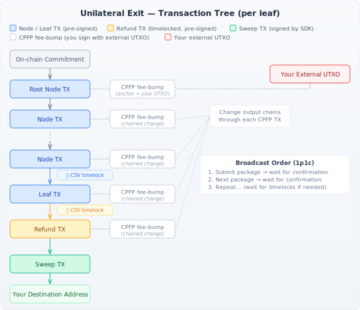

# Unilateral Exit

A unilateral exit allows you to withdraw your funds from Spark to the Bitcoin blockchain without cooperation from the Spark operators. This is a safety mechanism — in normal operation, you should use the [cooperative withdrawal](send_payment.md#bitcoin) flow, which is cheaper and faster. A unilateral exit is your last resort when the operators are unresponsive or uncooperative.

<div class="warning">
<h4>Developer note</h4>
A unilateral exit is a complex, multi-step process that requires external Bitcoin funds to pay on-chain fees and may take hours or days to complete depending on timelock durations. Only use this when cooperative withdrawal is not possible.
</div>

## How it works

Spark stores your balance in a tree of pre-signed Bitcoin transactions. Each leaf in the tree represents a portion of your balance. To unilaterally exit, you broadcast the chain of transactions from the tree root down to each leaf, followed by a refund transaction that pays to a refund address derived from your Spark key. A final sweep transaction then collects all refund outputs and sends them to your chosen destination address.

Each transaction in the chain has an **ephemeral anchor output** that requires a fee-bumping child transaction (CPFP — Child Pays For Parent) to incentivize miners. You provide an external UTXO to fund these CPFP transactions.

The SDK **automatically selects which leaves are profitable to exit** based on the fee rate and CPFP input you provide. A leaf is included only when its value exceeds the marginal cost of exiting it (CPFP fees for its ancestor chain plus its share of the sweep transaction fee). Leaves that share common ancestors benefit from reduced cost, so the SDK maximizes the total recovered value.



The diagram above shows the structure for a single leaf. The node transactions form a path from the root to the leaf. The leaf transaction's output is spent by the refund transaction, which pays to a refund address derived from your Spark key. A final sweep transaction collects all refund outputs and sends them to your chosen destination. Every transaction in the chain (except the sweep) is paired with a CPFP fee-bump transaction signed with your external UTXO key.

## Overview of the process

1. **Prepare the unilateral exit** — the SDK selects profitable leaves, builds all transactions, and signs the CPFP fee-bump transactions using your provided signer. It returns all transactions ready to broadcast.
2. **Broadcast the transaction packages** — you broadcast each parent+child pair, respecting dependencies and timelocks
3. **Broadcast the sweep transaction** — once all refund transactions are at least in the mempool, you broadcast the sweep to collect your funds

## Step 1: Prepare the unilateral exit

Call {{#name prepare_unilateral_exit}} with:
- One or more **CPFP inputs** (external UTXOs) to fund the CPFP fee-bump transactions
- A **fee rate** in sats/vbyte
- A **destination address** where your funds will be swept to
- A **signer** that can sign the CPFP transactions

### CPFP inputs

The CPFP inputs must be UTXOs you control. The CPFP fee-bump chain produces change outputs that go back to the **same address** as the first CPFP input. This address is reused for every change output in the chain, so make sure you use an address you are comfortable reusing (e.g., a dedicated address for this purpose).

The total value of the CPFP inputs must be sufficient to cover all CPFP fees for the selected leaves. If the inputs don't have enough value, the call returns an error.

### Signer

The SDK provides a default `SingleKeySigner` that handles P2WPKH and P2TR inputs from a single private key. If your CPFP inputs require a different signing scheme (e.g., multisig, hardware wallet, or you don't want to pass raw key material into the SDK), you can implement the `CpfpSigner` trait yourself. The trait receives a PSBT (Partially Signed Bitcoin Transaction) and must return it with the external inputs signed.

### Error cases

The call returns an error if:
- **No leaves are profitable** to exit at the given fee rate (every leaf's value is less than or equal to its exit cost). In this case, try lowering the fee rate or waiting for lower on-chain fees.
- **Insufficient CPFP input value** to cover the fees for the selected leaves.

{{#tabs unilateral_exit:prepare-unilateral-exit}}

### Response

The response contains:
- **{{#name selected_leaves}}**: A summary of each leaf the SDK chose to exit, including its value and estimated exit cost
- **{{#name transactions}}**: For each selected leaf, an ordered list of signed transaction pairs to broadcast
- **{{#name sweep_tx_hex}}**: A fully signed transaction that sweeps all refund outputs to your destination

Each entry in {{#name selected_leaves}} contains:
- **{{#name id}}**: The leaf's unique identifier
- **{{#name value}}**: The leaf's value in satoshis
- **{{#name estimated_cost}}**: The estimated marginal cost to exit this leaf (CPFP chain fees + sweep input fee). The actual profit per leaf is `value - estimated_cost`.

Each transaction pair in {{#name transactions}} contains:
- **{{#name parent_tx_hex}}**: The pre-signed Spark transaction (node TX, leaf TX, or refund TX)
- **{{#name child_tx_hex}}**: The signed CPFP fee-bump transaction (ready to broadcast)
- **{{#name csv_timelock_blocks}}**: If present, the number of blocks you must wait after the previous transaction confirms before this pair can be broadcast

## Step 2: Broadcast the transaction packages

You are responsible for broadcasting the transactions yourself. Bitcoin Core enforces a **1-parent-1-child (1p1c)** package relay policy — each parent+child pair must be broadcast together as a package.

### How to broadcast a package

If your Bitcoin node supports `submitpackage` (Bitcoin Core 28.0+), use it:

```
bitcoin-cli submitpackage '["<parent_tx_hex>", "<child_tx_hex>"]'
```

Many block explorers also support package submission.

### Dependencies and broadcast order

Within each leaf's transaction list, the pairs must be broadcast in order — each transaction spends from the previous one's output. A pair can only be broadcast once the previous pair's parent transaction is confirmed (or in the mempool, for non-timelocked transactions).

A single leaf's chain looks like:

| # | Transaction | Timelock | Description |
|---|-------------|----------|-------------|
| 1 | Root Node TX | None | First in the chain, spends from the on-chain commitment |
| 2+ | Intermediate Node TXs | None | Each spends from the previous node's output |
| | Leaf TX | **Yes** | Spends from the last node; has a relative timelock |
| | Refund TX | **Yes** | Spends from the leaf TX; pays to your Spark-derived refund address |

When exiting **multiple leaves**, some node transactions may be shared between leaves (they share the same path from the root). The SDK deduplicates these — each unique node transaction appears only once, in the first leaf that uses it. Subsequent leaves only contain the pairs from where their path diverges.

### Handling timelocks

When a pair has a {{#name csv_timelock_blocks}} value, you **cannot broadcast it** until the specified number of blocks have been mined after the previous transaction confirms. For example, if the leaf TX has {{#name csv_timelock_blocks}}: 2000, you must wait 2,000 blocks (~14 days) after the last node TX confirms before broadcasting the leaf TX package.

<div class="warning">
<h4>Developer note</h4>
The timelock is a <b>relative</b> lock (BIP68 CSV). It counts blocks from the confirmation of the output being spent, not from any absolute block height. Your application should monitor the blockchain and broadcast the next package as soon as the timelock expires.
</div>

Because of the timelocks on leaf and refund transactions, a full unilateral exit takes multiple days. Your application should persist the transaction data from the prepare response and schedule broadcasts as timelocks expire.

## Step 3: Broadcast the sweep transaction

Once all refund transactions are at least in the mempool, broadcast the sweep transaction ({{#name sweep_tx_hex}}). This is a standard Bitcoin transaction (not a package) that spends from all refund outputs and sends the total value (minus fees) to your destination address.

```
bitcoin-cli sendrawtransaction "<sweep_tx_hex>"
```

The sweep transaction will remain in the mempool until all refund transactions it depends on are confirmed.

## Fee considerations

A unilateral exit involves two types of fees:

1. **CPFP fees**: Paid from your external UTXO to fee-bump each transaction in the chain. The total CPFP cost depends on the tree depth, the number of leaves being exited, and the fee rate.

2. **Sweep transaction fee**: Deducted from the refund output values. This fee is calculated at the same fee rate you specify in the prepare request.

### Automatic leaf selection

The SDK automatically determines which leaves are worth exiting. For each leaf, it calculates the marginal cost of including it:
- **CPFP chain fees** for any ancestor transactions not already covered by a higher-value leaf
- **Incremental sweep fee** for adding one more input to the sweep transaction

A leaf is only included when its value strictly exceeds this marginal cost. The SDK processes leaves from highest to lowest value, so higher-value leaves cover the shared ancestor costs and make it cheaper for smaller leaves to be included.

The {{#name estimated_cost}} field in each selected leaf's summary reflects this marginal cost, so you can inspect the expected profit per leaf.

### CPFP change output

Each CPFP fee-bump transaction has a single change output that goes back to the **same address** as the first CPFP input. This change output is automatically used as the input for the next CPFP transaction in the chain, forming a chain of fee-bumping transactions. After the last CPFP transaction confirms, the remaining change is yours to spend from that address.

Ensure the external UTXO has enough value to cover all CPFP fees for all selected leaves.

## Troubleshooting

| Problem | Cause | Solution |
|---------|-------|----------|
| "No leaves are profitable to exit" | Every leaf costs more to exit than it is worth at the current fee rate | Lower the {{#name fee_rate}} or wait for lower on-chain fees |
| "CPFP input value is too low to cover the fee" | The external UTXO doesn't have enough value for all CPFP fees | Provide a UTXO with more value |
| "min relay fee not met" | CPFP fee too low for the package | Increase the {{#name fee_rate}} parameter |
| "mandatory-script-verify-flag-failed" | CPFP transaction not signed correctly | Ensure your `CpfpSigner` implementation signs all inputs correctly |
| "non-BIP68-final" | Timelock has not expired | Wait for the required number of confirmations on the previous transaction |
| Transaction not relayed | Parent+child not submitted as package | Use `submitpackage` or a block explorer's package submission |
| Sweep transaction rejected | Not all refund TXs are in the mempool yet | Wait for all refund transactions to be broadcast before broadcasting the sweep |
