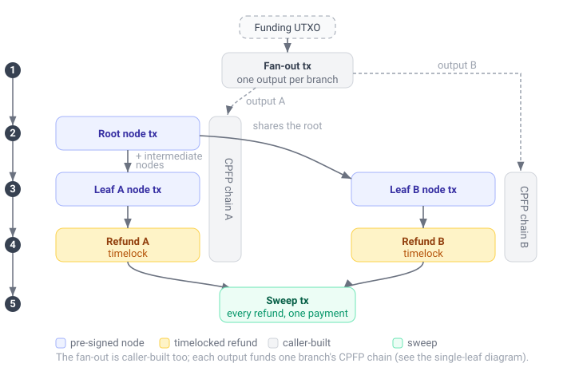

# Unilateral exit

A unilateral exit moves your Spark balance onto the Bitcoin blockchain without needing the Spark operators to sign the withdrawal for you. It exists as a safety net: if the operators ever stop cooperating with normal [withdrawals](send_payment.md), you can still recover your funds on-chain.

<div class="warning">
A unilateral exit is a last resort. It is a multi-step, on-chain process that needs your own Bitcoin (in a separate UTXO) to pay mining fees, and it can take several days to finish because of on-chain timelocks. When a normal cooperative withdrawal is available, it is always cheaper and faster: prefer it.
</div>

## Before you start

Three things are important to know before you build an exit:

- **The exit data has to already be on the device.** Quoting and building an exit read each leaf's pre-signed transactions from local storage, so both work with the operators unreachable. What they cannot do is obtain that data: a leaf can be exited this way only once it has been synced at least once while the operators were reachable. The SDK collects it as funds arrive, in the background where background services run and otherwise during {{#name sync_wallet}}, which you can turn off with [{{#name exit_chain_auto_fetch_enabled}}](./config.md#unilateral-exit-data). Call {{#name sync_wallet}} before going offline to run the collection at a moment of your choosing rather than waiting on the background one. Once collected it can be kept outside the SDK's storage, see [Back up the exit data](#back-up-the-exit-data).
- **You pay the fees from your own UTXO.** The pre-signed transactions carry no fee, so each is fee-bumped with a child transaction (CPFP) funded by a Bitcoin UTXO you provide. That UTXO must be **native SegWit** (a witness-program script). P2WPKH and P2TR are handled by the built-in signer; any other witness program (for example a P2WSH multisig) works through the {{#enum CpfpFundingKind::Custom}} funding kind and a custom signer (see [The signer](#the-signer)). Legacy (non-SegWit) scripts are rejected.
- **You broadcast the transactions yourself.** The SDK builds and signs the full set but never broadcasts. You send them to the network over time, in order, as their timelocks mature. See [Broadcasting the transactions](#broadcast-the-transactions).

## How it works

Your balance is held in a tree of pre-signed Bitcoin transactions. Each leaf is a portion of the balance. To move a leaf on-chain you broadcast the chain of transactions from the tree down to that leaf, then a refund transaction, then a final sweep to your destination address. Because the pre-signed transactions pay no fee on their own, each one is broadcast together with a CPFP child that pays its fee.

The exit is three calls, and you will use all three:

1. {{#name prepare_unilateral_exit}} quotes the exit: it picks which leaves to exit and reports the exact fee and how much to fund, without needing any funding UTXOs yet.
2. {{#name unilateral_exit}} takes that quote plus your funding UTXOs and a signer, and returns the complete, signed set of transactions to broadcast. **Store what it returns.**
3. {{#name check_unilateral_exit}} takes what you stored and tells you where the exit has got to and what to send next. **Store what it returns, in place of what you had.**

An exit runs for days, so you will call the third one many times: after each broadcast, and whenever you want to know how far along it is.

### A single leaf

With one leaf there is no fan-out: your funding UTXO pays the fees directly. You broadcast the tree transactions top to bottom, each with its CPFP child as a package, then the refund once its timelock matures, then the sweep.


The blue transactions come pre-signed and fixed; you cannot change them. The grey CPFP children and the green sweep are built for you from the funding you supply, and are what actually pay the fees and deliver the funds to your address.

### Multiple leaves

Exiting several leaves at once starts with a **fan-out** transaction that splits a single funding UTXO into one output per branch. Leaves that share ancestors in the tree share those transactions too, so a shared ancestor is broadcast only once. Every branch's refund is then pulled into a single sweep.



## Leaf denominations and exit cost

Every leaf is exited by its own chain of transactions, so it carries its own on-chain fee whatever its value. The more leaves your balance is spread across, and the smaller they are, the more of it goes to fees on the way out, and the more low-value leaves an {{#enum ExitLeafSelection::Auto}} exit abandons as uneconomical dust.

How the balance is split into leaves is governed by the SDK's leaf optimization, which balances everyday payment experience against unilateral exit value. More, smaller denominations let payments go out without leaf swaps, while fewer, larger denominations cost less to exit. The default leans toward payment experience, which suits most wallets, since a unilateral exit is a rare last resort. See [Custom leaf optimization](optimize.md) to understand this tradeoff and adjust it if your use case calls for it.

## Quote the exit

Call {{#name prepare_unilateral_exit}} with the target {{#name fee_rate_sat_per_vbyte}}, the {{#name funding_kind}} of UTXO you will pay fees with, your {{#name destination}} address, and a {{#name selection}}. {{#enum ExitLeafSelection::Auto}} exits every leaf worth more than its own exit cost; {{#enum ExitLeafSelection::Specific}} exits exactly the leaves you name.

The quote returns a {{#name PrepareUnilateralExitResponse}}. Its fields tell you how much Bitcoin to gather and how to structure it:

- {{#name recoverable_value_sat}} is the total value of the selected {{#name leaves}}, and {{#name total_fee_sat}} is the on-chain fee to recover it. Compare them to decide whether the exit is worth it at the current fee rate.
- {{#name single_utxo_funding_sat}} is the simplest option: fund **one** UTXO of at least this many satoshis and the SDK fans it out across branches.
- {{#name per_branch_funding}} lets you skip the fan-out (and its {{#name fanout_fee_sat}}) by funding **one UTXO per branch**, each of at least the amount in its {{#name PerBranchFunding}} entry.

So you do not have to guess how much to send or how many UTXOs to prepare: the quote tells you both.

Preparing also reads the chain, and {{#name exit_chain_state}} carries back what it found: which nodes are already on-chain, which refunds landed, and which of those have been swept. Pass the whole {{#name PrepareUnilateralExitResponse}} to {{#name unilateral_exit}} unchanged, so the build covers only the steps still left. You can read it yourself to show how far an exit has got.

Under {{#enum ExitLeafSelection::Auto}} a leaf is kept when its value exceeds its own exit cost, measured per leaf. That per-leaf measure does not include the shared {{#name fanout_fee_sat}}, which the single-UTXO path pays once for the whole exit. So when you fund a multi-leaf exit from a **single** UTXO, the fan-out fee can push the total above what you recover, even though every leaf looked profitable on its own.

Two rules keep an exit from ever costing more than it returns:

1. **Before funding, require {{#name recoverable_value_sat}} to exceed {{#name total_fee_sat}}.** These are the actual totals for the quote, fan-out fee included. If the margin is thin or negative, do not proceed as quoted.
2. **Prefer per-branch funding.** Funding one UTXO per branch ({{#name per_branch_funding}}) skips the fan-out entirely, so there is no shared fee. Because {{#enum ExitLeafSelection::Auto}} already keeps only leaves worth more than their own cost, a per-branch-funded auto exit is always net-positive.

If the single-UTXO total is not worth it, either fund per branch, or narrow the set: re-quote with {{#enum ExitLeafSelection::Specific}} naming only the higher-value leaves (dropping the marginal ones removes their cost and can turn the total positive), or wait for a lower fee rate.

If nothing is selected (under {{#enum ExitLeafSelection::Auto}} no leaf is worth exiting at the given fee rate, or there is nothing to exit) the response comes back empty rather than as an error. Check {{#name leaves}} before gathering funding.

{{#tabs unilateral_exit:prepare-unilateral-exit}}

## Build the exit

Gather funding that meets the quote, then call {{#name unilateral_exit}} with the quote, your real {{#name CpfpInput}} funding UTXOs, and a signer. It returns a {{#name UnilateralExitResponse}} with the actual {{#name total_fee_sat}} and the full transaction set.

If the funding is below what the exit needs it returns {{#enum SdkError::InsufficientCpfpFunds}}, naming the amount. A UTXO an earlier attempt already spent is not an error: see [Funding a second attempt](#funding-a-second-attempt).

A very thin-margin exit can fail even when the funding is sufficient: if the recoverable value net of fees would leave the swept output below the destination address's dust limit, the sweep cannot be built and the exit fails. Exit higher-value leaves with {{#enum ExitLeafSelection::Specific}}, lower the {{#name fee_rate_sat_per_vbyte}}, or wait for a cheaper fee rate.

The set it builds depends on what is already on-chain. Because each CPFP child spends the previous one, the exit is one connected chain, so to continue it correctly the SDK reads confirmed on-chain state through its chain service: a step already confirmed comes back as {{#enum ConfirmationStatus::Confirmed}} and is not rebuilt. If the chain service cannot resolve a step, the SDK falls back to the status the operators reported: a node the operators already consider on-chain is left as-is rather than fee-bumped (bumping an already-confirmed node would invalidate the rest of the chain), and any node whose state still cannot be determined comes back as {{#enum ConfirmationStatus::Unverified}} and is treated as not yet confirmed rather than failing the build. You still get the full set back; broadcasting an already-confirmed transaction is harmless, and re-running once the chain service recovers resolves the status. For a more reliable source you can supply your own chain service (see [Customizing the SDK](customizing.md#with-chain-service)).

{{#tabs unilateral_exit:unilateral-exit}}

### The signer

The CPFP children and the fan-out spend your funding UTXOs, so they have to be signed. The SDK does not hold your funding keys; it hands each unsigned transaction to a signer you provide.

The built-in single-key signer covers the common case: it signs P2WPKH and P2TR inputs from one secret key. For {{#enum CpfpInput::P2tr}} funding, pass the **internal, untweaked (BIP86)** key, not the tweaked on-chain output key: the tweaked key derives a scriptPubKey that does not match the UTXO, so the transaction is rejected at broadcast. For anything else (a multisig, a hardware wallet, or keeping key material out of the SDK entirely) implement the {{#name CpfpSigner}} interface and describe the funding with {{#enum CpfpFundingKind::Custom}} (in the quote) and {{#enum CpfpInput::Custom}} (in the build). Those carry the funding {{#name script_pubkey_hex}} and an upper-bound {{#name signed_input_weight}} so the fee stays exact for any witness program. The signer receives a serialized PSBT, signs the inputs that are not already finalized, and returns the serialized signed PSBT:

Whichever signer you use, the funding inputs must be **native SegWit** (a witness-program script; P2WPKH or P2TR with the built-in signer, any other witness program with a custom one). The exit refers to each transaction by an id it computes before signing, which only stays stable when the signature lives in the witness (native SegWit) rather than in the input script; legacy scripts are rejected, so your signer only ever has to sign native SegWit inputs.

{{#tabs unilateral_exit:custom-cpfp-signer}}

<div class="warning">
<h4>Flutter</h4>
Flutter cannot pass a foreign <code>CpfpSigner</code>, so it exposes two exit calls. <code>unilateralExit</code> takes the funding secret key bytes and uses the built-in single-key signer. <code>unilateralExitWithSigner</code> takes a <code>signPsbt</code> callback that receives the serialized PSBT, signs the inputs that are not already finalized (any scheme), and returns the serialized signed PSBT.
</div>

## Store the response

Store the whole {{#name UnilateralExitResponse}} as soon as you get it, before you broadcast anything. It is the only record of the exit: the signed transactions, the leaves they recover, and the funding you paid with. Losing it means losing the ability to follow or finish the exit, even though the money is still recoverable.

Store the one {{#name check_unilateral_exit}} returns in its place each time you call it. Nothing else needs keeping alongside it.

## Broadcast the transactions

The SDK does not broadcast anything. {{#name transactions}} is the complete, signed set in valid broadcast order, and it is yours to send to the network over time. Broadcast each transaction once it is ready: {{#name dependencies_met}} is set, and its {{#name csv_timelock_blocks}} relative timelock has matured against the current block height. Because of those timelocks, a full exit can span several days.

### Broadcast each package together

Most steps come as a pair: a tree transaction and its {{#name cpfp_tx_hex}} CPFP child. The tree transaction pays no fee on its own, so a normal single-transaction broadcast rejects it; only the child makes the pair pay enough. Broadcast the two together, as a package, with a node that supports package relay, for example Bitcoin Core:

```text
bitcoin-cli submitpackage '["<tx_hex>", "<cpfp_tx_hex>"]'
```

The **fan-out** and the **sweep** are the exceptions: each pays its own fee and has no CPFP child ({{#name cpfp_tx_hex}} is unset), so you broadcast it **alone**, as an ordinary transaction, anywhere, including a public endpoint such as `POST https://mempool.space/api/tx`. Most public broadcast APIs, including mempool.space, accept only one transaction at a time and cannot submit a package, so they reject the zero-fee tree transactions; use a package-relay-capable node (or service) for the pairs.

### Wait for each step to confirm

Within a branch you broadcast one package, wait for it to confirm, then broadcast the next. This is a mempool relay limit, not a Bitcoin consensus rule: nodes relay an unconfirmed parent with at most one unconfirmed child (the "one-parent-one-child", or 1P1C, package), so a second still-unconfirmed package stacked on top would not propagate. Once a package confirms, the next one has a confirmed parent and can go out. (A refund's {{#name csv_timelock_blocks}} is a separate wait, and that one is a consensus rule.)

### Order and parallelism

Follow {{#name depends_on}} to order the set: a transaction can go out as soon as the transactions it lists have confirmed. With a single leaf this is one straight line, top to bottom. With several leaves the branches are largely independent, so to finish faster you can broadcast them in parallel and serialize only where {{#name depends_on}} actually links them:

1. **The fan-out first, and alone.** It pays its own fee and has no CPFP child, so it is an ordinary single-transaction broadcast. Wait for it to confirm before any branch package: every branch's first package depends on it.
2. **Then the branch packages, each node transaction with its CPFP child.** A shared ancestor appears once, listed in the {{#name depends_on}} of every branch that needs it, so you broadcast it a single time. Within a branch, send one package, wait for it to confirm, then the next (the 1P1C limit above); across branches you can work in parallel.
3. **The sweep last, and alone,** once every refund in its {{#name depends_on}} has confirmed.

## The transaction set

Each {{#name UnilateralExitTransaction}} in {{#name transactions}} carries:

- {{#name kind}}: whether it is the fan-out, a tree node, a refund, or the sweep.
- {{#name node_id}}: the tree node a transaction belongs to (the leaf id for a refund), unset for the fan-out and the sweep.
- {{#name txid}} and {{#name tx_hex}}: the signed transaction to broadcast.
- {{#name cpfp_tx_hex}}: its signed CPFP child, to broadcast alongside {{#name tx_hex}} as a package. Unset for the fan-out and the sweep, and for a step that is already confirmed.
- {{#name csv_timelock_blocks}}: the relative timelock, in blocks, that must mature before the transaction can confirm.
- {{#name depends_on}}: the txids of other transactions in the set that must confirm first.
- {{#name dependencies_met}}: whether all of those have confirmed. It does not account for {{#name csv_timelock_blocks}}, which you check against the current block height yourself.
- {{#name status}}: whether the transaction is already on-chain. {{#enum ConfirmationStatus::Confirmed}} means it is done and can be skipped, and carries the {{#name block_height}} it landed at, which is what a {{#name csv_timelock_blocks}} on its child counts from; {{#enum ConfirmationStatus::Unconfirmed}} is the normal state of a step that is not yet on-chain and that you must broadcast; {{#enum ConfirmationStatus::Unverified}} means its on-chain status could not be determined (see the troubleshooting table).

## Follow the exit

An exit takes days, and you are broadcasting it yourself, so you need a way to ask how far it has got. That is {{#name check_unilateral_exit}}: hand it the response you stored, and it hands the same exit back with every transaction's status brought up to date. Store that one in place of what you had.

Call it after each broadcast, and whenever you want to show progress. It reads the chain and nothing else: no wallet, no leaves, no signer, no funding. An exit can be followed on a device that has lost everything but the stored response.

Its {{#name verdict}} says what to do next:

- {{#enum UnilateralExitVerdict::Valid}}: the exit is on track. Broadcast the transactions whose {{#name dependencies_met}} is set and whose {{#name csv_timelock_blocks}} has matured. Sending one you already sent is harmless, so you never have to remember what you broadcast.
- {{#enum UnilateralExitVerdict::Done}}: every transaction has confirmed, the sweep included. The money is at your destination address and there is nothing left to do.
- {{#enum UnilateralExitVerdict::Redo}}: this exit cannot finish as it stands. See [Starting over](#starting-over).

{{#enum UnilateralExitVerdict::Redo}} means something on-chain no longer matches the transactions you hold: a different refund for the same leaf confirmed, someone fee-bumped a step in a way yours cannot follow, or funding you were counting on went elsewhere. Your money is not lost, and the fix is always the same: quote and build again.

{{#tabs unilateral_exit:check-unilateral-exit}}

## Funding a second attempt

Whenever you call {{#name unilateral_exit}} again, you have to give it funding. Two options, and the first is simpler:

- **Fresh UTXOs.** Fund the amount the new quote asks for and pass those. Nothing to keep track of.
- **The same UTXOs as last time.** Pass back the {{#name funding_inputs}} the stored response carries. An earlier attempt will have spent them, and that is fine: the SDK follows each outpoint to what your money became, whether that is a fan-out output, the change of a fee-bumping transaction, or several steps of both. Only what came from money you supplied, and still pays a script you control, is used.

Either way you can add more: pass the old funding *and* a fresh UTXO when the exit needs more than what is left.

The exit is short only when what you gave it, once followed, cannot cover what remains. Then it returns {{#enum SdkError::InsufficientCpfpFunds}} with the amount it needs.

## Starting over

Two things send you back to {{#name prepare_unilateral_exit}} and {{#name unilateral_exit}}. In both cases you build the exit again from scratch: you never hand a previously built transaction back to the SDK.

**You want to pay a higher fee rate.** On-chain fees rise, and an exit already under way stops confirming. Quote again at the higher {{#name fee_rate_sat_per_vbyte}}, naming the same leaves with {{#enum ExitLeafSelection::Specific}}, and build again. Whatever has already confirmed stays as it is and costs nothing to keep; only what has not yet confirmed is rebuilt at the higher rate, and it replaces the earlier version on the network (RBF). The fee you are quoted is for the part that is left, so it is less than a fresh exit of the same leaves.

**{{#name check_unilateral_exit}} returned {{#enum UnilateralExitVerdict::Redo}}.** The chain no longer matches the exit you hold, so those transactions cannot finish. Quote and build again the same way. Your funds are not lost: they are still in the tree, or already in an output you control, and the new exit picks up from wherever they are.

Name the leaves with {{#enum ExitLeafSelection::Specific}} rather than {{#enum ExitLeafSelection::Auto}} both times, taking the ids from your stored response. This is the dependable way to pick an exit back up, including a leaf still waiting out its refund timelock.

Both calls read the chain, so both price only what is left. A leaf far enough along stays worth exiting under {{#enum ExitLeafSelection::Auto}} even when a fresh exit of it would not be.

## Back up the exit data

The transactions an exit is built from are held in the SDK's local storage. While the operators are reachable they can be fetched again, so a wallet restored from its seed rebuilds them on its own. When that storage is gone and the operators are unreachable, they cannot be recovered from anywhere, and the leaves they cover cannot be exited.

{{#name export_unilateral_exit_state}} returns that data as a single opaque value, covering every leaf the wallet holds together with the transactions that spend it. It reflects what is present when it is called: a leaf whose data has not been collected yet is exported without it. The value grows with the number of leaves and can reach several megabytes.

Treat the value as sensitive. Carrying every leaf and its transactions, it discloses the wallet's balance, how that balance is split up, and the history of what the wallet has received and spent. Encrypt it wherever you keep it.

{{#tabs unilateral_exit:export-unilateral-exit-state}}

The SDK emits {{#enum SdkEvent::UnilateralExitStateChanged}} once it has completed the data for a leaf that was missing it, and whenever it rebuilds a leaf's data. That is the point at which a previously exported value stops covering the wallet. A leaf the operators answer for only in part is not announced: what came back still cannot back an exit, and it stays that way until they complete it.

{{#name import_unilateral_exit_state}} puts an exported value back. It does not contact the operators, so it works while they are unreachable, and the value must come from the same network the SDK is configured for. A leaf is taken only when the exit state records this wallet as its owner; the rest are skipped and counted in {{#name skipped_foreign_leaves}}.

For the leaves it does take, the wallet keeps whatever exit data it can already exit with. An exported value carries no mark of when it was taken, so nothing in it says it is newer than what is on the device; the imported copy is used only for a leaf the wallet has nothing usable for, and only when that copy is complete on its own. Importing an out of date or half-collected value therefore never leaves a leaf less exitable than it already was. Leaves the wallet keeps but whose imported copy it did not use are counted in {{#name skipped_chains}}.

A leaf is dropped outright when its imported copy disagrees with a node the wallet already holds, on a value that cannot change over a node's lifetime. One of the two copies is then simply wrong about that node, and nothing in the entry is trusted on the strength of it, so the leaf is not restored at all. These are counted separately, in {{#name skipped_conflicting_leaves}}, because unlike the counts above they mark exit data the import could not put back.

{{#tabs unilateral_exit:import-unilateral-exit-state}}

An out of date value can restore leaves that have since been spent, so the balance may read high until the next sync reconciles it with the operators.

## Troubleshooting

| Problem | Cause | Solution |
|---------|-------|----------|
| {{#name prepare_unilateral_exit}} returns no {{#name leaves}} | Under {{#enum ExitLeafSelection::Auto}}, no leaf is worth exiting at the current rate | Lower {{#name fee_rate_sat_per_vbyte}} or wait for cheaper on-chain fees (this is not an error) |
| A leaf you are mid-exit on is missing from a new {{#enum ExitLeafSelection::Auto}} quote | The new quote reselected leaves instead of naming them | Quote with {{#enum ExitLeafSelection::Specific}}, naming the leaves from your stored response |
| {{#name check_unilateral_exit}} returns {{#enum UnilateralExitVerdict::Redo}} | Something on-chain no longer matches the transactions you hold | Quote and build again, naming the same leaves; see [Starting over](#starting-over) |
| The exit has stopped confirming | On-chain fees rose above what its transactions pay | Quote and build again at a higher {{#name fee_rate_sat_per_vbyte}}; see [Starting over](#starting-over) |
| {{#name total_fee_sat}} is close to or above {{#name recoverable_value_sat}} | The shared fan-out fee makes a single-UTXO multi-leaf exit uneconomical | Fund one UTXO per branch ({{#name per_branch_funding}}) to drop the fan-out fee, exit fewer leaves with {{#enum ExitLeafSelection::Specific}}, or wait for a lower fee rate |
| The build/sweep fails with a "below the dust limit" error | The recoverable value net of fees is below the destination's dust limit | Exit higher-value leaves with {{#enum ExitLeafSelection::Specific}}, lower the {{#name fee_rate_sat_per_vbyte}}, or wait for a cheaper fee rate |
| {{#enum SdkError::InsufficientCpfpFunds}} | The funding you gave, once followed to what it became, is below what the exit needs | Fund at least {{#name single_utxo_funding_sat}}, or the amount in each {{#name PerBranchFunding}}; you can pass fresh UTXOs alongside the old ones |
| "min relay fee not met" when broadcasting | The package fee is too low for the network | Increase {{#name fee_rate_sat_per_vbyte}}, rebuild, and re-broadcast (RBF) |
| "mandatory-script-verify-flag-failed" | A CPFP child was not signed correctly | Ensure your {{#name CpfpSigner}} signs every non-finalized input |
| "non-BIP68-final" | A relative timelock has not matured | Wait the required {{#name csv_timelock_blocks}} after the parent confirms |
| A tree transaction is rejected on its own | The zero-fee parent was broadcast without its child | Broadcast the parent and its {{#name cpfp_tx_hex}} together as a package |
| The sweep is rejected | Not every refund it spends has confirmed | Wait until {{#name check_unilateral_exit}} reports its {{#name dependencies_met}} |
| A transaction's {{#name status}} is {{#enum ConfirmationStatus::Unverified}} | The chain service was unavailable or rate-limited, so the SDK could not tell whether that step is already on-chain | Retry, or use a more reliable chain service (see [Customizing the SDK](customizing.md#with-chain-service)); {{#name check_unilateral_exit}} re-checks |
